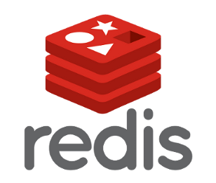
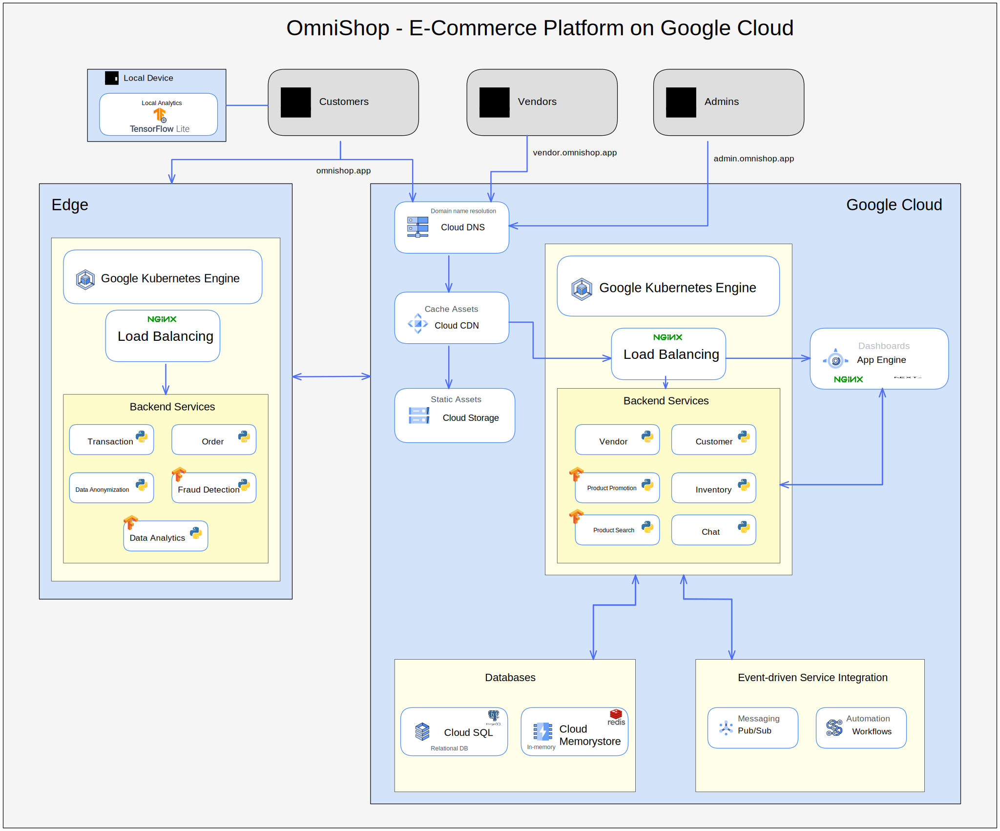

@import "./assets/tailwind.min.css"
@import "./node_modules/@shd101wyy/mume/styles/preview_theme/gothic.css"
@import ".mume/style.less"

# Cloud Architecture of an E-Commerce Platform

Submission of Péter Ferenc Gyarmati

11913446

<a href="mailto:peter.ferenc.gyarmati@univie.ac.at">peter.ferenc.gyarmati@univie.ac.at</a>

## Application Overview

Selling products online is on the rise, however there is a significant entry-barrier for small and medium sized businesses to enter the market. The main reason for this is the high cost of setting up and maintaining an online store. This is where an e-commerce marketplace comes in. An e-commerce marketplace is a platform that allows vendors to list their products and buyers to purchase them, taking a commission on each sale. This allows vendors to focus on their core business and buyers to have a wide variety of products to choose from while delegating the task of developing and maintaining the platform where the actual sales and logistics take place. The marketplace also provides a platform for vendors to advertise their products and buyers to find them and leave reviews. The information system I propose and design in this project aims to realise such an E-Commerce platform.

### Functional Requirements

- Customers can register and login to the system
- Vendors can register and list their products
- Vendors can promote their products for a period of time
- Promoted products appear for users automatically based on their preferences and real-time interactions with the system
- Customers can search for products and observe them in detail, with support for image recognition
- Customers can buy products
- Customers can choose from payment methods such as credit card, PayPal, and bank transfer
- Customers can leave ratings and reviews for products
- Customers can connect with vendors in built-in chat rooms
- The system detects fraudulent activities and blocks the corresponding accounts

### Non-Functional Requirements

- The system should be highly available across the globe
- The system should have extremely low latency to ensure a good user experience and the maximization of conversions
- The system should be scalable to handle a large number of concurrent users
- The system should tolerate spikes in traffic (e.g. before Holidays, Black Friday, etc.)
- The system should be secure and protect customer and vendor data
- Data-loss should be prevented to maximize the satisfaction of customers and vendors

## Architecture Overview

In what follows, I will describe the logical architecture of the system using textual and UML-diagrammatic representations.

### Use Cases

To give a better impression of the system and its foreseen capabilities, I present a use case diagram in this section.

#### Actors

In the context of the proposed system, the below-described actors can be identified.

- **Admin**: An employee of the marketplace platform, responsible for admitting new vendors to the system and verifying that they represent a legitimate business.
- **Customer**: A user of the system who can buy products from vendors.
- **Vendor**: A user of the system who can list products for sale.
- **Payment Service Provider**: A third-party service that provides payment processing capabilities to the system.

#### Specifications

The specification of the diagrammed use cases are defined as follows.

##### Register as Customer

- **Description**: A customer can register to the system by providing their name, email address, and password.
- **Pre-conditions**: The customer is not registered to the system.
- **Post-conditions**: The customer is registered to the system.
- **Basic Flow**: The customer provides their name, email address, and password. The system verifies that the email address is not already registered to the system. If the email address is not registered, the system creates a new customer account and sends a verification email to the customer. The customer clicks on the verification link in the email and is redirected to the system. The system verifies the verification link and marks the customer as verified.
- **Alternative Flow**: If the email address is already registered to the system, the system notifies the customer and asks them to login or reset their password.
- **Involved Actors**: _Customer_

##### Register as Vendor

- **Description**: A vendor can register to the system by providing their name, email address, and password.
- **Pre-conditions**: The vendor is not registered to the system.
- **Post-conditions**: The vendor is registered to the system.
- **Basic Flow**: The vendor provides their name, email address, and password. The system verifies that the email address is not already registered to the system. If the email address is not registered, the system creates a new vendor account and sends a verification email to the vendor. The vendor clicks on the verification link in the email and is redirected to the system. The system verifies the verification link and marks the vendor as verified.
- **Alternative Flow**: If the email address is already registered to the system, the system notifies the vendor and asks them to login or reset their password.
- **Involved Actors**: _Vendor_

##### Login

- **Description**: A user can login to the system by providing their email address and password.
- **Pre-conditions**: The user is registered to the system.
- **Post-conditions**: The user is logged in to the system.
- **Basic Flow**: The user provides their email address and password. The system verifies that the email address is registered to the system and that the password is correct. If the email address and password are correct, the system logs the user in and redirects them to the home page.
- **Alternative Flow**: If the email address is not registered to the system, the system notifies the user and asks them to register. If the email address is registered to the system but the password is incorrect, the system notifies the user and asks them to try again.
- **Involved Actors**: _Customer_, _Vendor_

##### Vendor Verification

- **Description**: An admin verifies a vendor by checking their business information, before allowing them to list products for sale.
- **Pre-conditions**: The vendor is registered to the system and is not verified.
- **Post-conditions**: The vendor is verified and can list products for sale.
- **Basic Flow**: The admin verifies whether the business represented by the vendor is legitimate with the help of a pre-defined checklist. If the business is legitimate, the admin verifies the vendor and allows them to list products for sale.
- **Alternative Flow**: If the business is not legitimate, the admin rejects the vendor and notifies them of the reason.
- **Involved Actors**: _Admin_, _Vendor_

##### List Products for Sale

- **Description**: A vendor can list products for sale by providing their name, description, price, and images.
- **Pre-conditions**: The vendor is verified.
- **Post-conditions**: The vendor has listed a product for sale.
- **Basic Flow**: The vendor provides the product name, description, price, and images. The system verifies that the vendor is verified. If the vendor is verified, the system lists the product for sale.
- **Alternative Flow**: If the vendor is not verified, the system notifies the vendor and asks them to contact an admin.
- **Involved Actors**: _Vendor_

##### Promote Product

- **Description**: A vendor can promote a product for a period of time by paying a fee.
- **Pre-conditions**: The vendor is verified and has listed a product for sale.
- **Post-conditions**: The vendor has promoted a product for a period of time.
- **Basic Flow**: The vendor selects a product and specifies the duration of the promotion. The system verifies that the vendor is verified and that the product is listed for sale. If the vendor is verified and the product is listed for sale, the system charges the vendor's account and promotes the product for the specified duration.
- **Alternative Flow**: If the vendor is not verified, the system notifies the vendor and asks them to contact an admin. If the product is not listed for sale, the system notifies the vendor and asks them to list the product for sale.
- **Involved Actors**: _Vendor_

##### View Listed Products

- **Description**: A customer can view products listed for sale by vendors.
- **Pre-conditions**: The customer is logged in to the system.
- **Post-conditions**: The customer has viewed products listed for sale by vendors.
- **Basic Flow**: The customer selects a category and a sub-category. The system displays the products listed for sale in the selected category and sub-category.
- **Alternative Flow**: None.
- **Involved Actors**: _Customer_

##### Buy Products

- **Description**: A customer can buy products listed for sale by vendors.
- **Pre-conditions**: The customer is logged in to the system and has selected a product to buy.
- **Post-conditions**: The customer has bought a product.
- **Basic Flow**: The customer selects a product and specifies the quantity. The system verifies that the product is listed for sale and that the quantity is available. If the product is listed for sale and the quantity is available, the system charges the customer's account and delivers the product to the customer.
- **Alternative Flow**: If the selected quantity is not available, the system notifies the customer and asks them to select a different quantity.
- **Involved Actors**: _Customer_

##### Conduct Payment

- **Description**: A customer can conduct a payment by choosing one of the available payment methods: credit card, PayPal or bank transfer.
- **Pre-conditions**: The customer is logged in to the system and has selected a product to buy.
- **Post-conditions**: The customer has conducted a payment.
- **Basic Flow**: The customer selects a payment method and provides the required information. The system verifies that the payment method is supported by the vendor. If the payment method is supported, the system charges the customer's account and delivers the product to the customer.
- **Alternative Flow**: If the payment method is not supported, the system notifies the customer and asks them to select a different payment method.
- **Involved Actors**: _Customer_, _Payment Service Provider_

##### Leave Rating and Review

- **Description**: A customer can leave a rating and review for a product after buying it.
- **Pre-conditions**: The customer is logged in to the system and has bought a product.
- **Post-conditions**: The customer has left a rating and review for a product.
- **Basic Flow**: The customer selects a product and leaves a rating and review. The system verifies that the customer has bought the product. If the customer has indeed bought the product, the system saves the rating and review.
- **Alternative Flow**: If the customer has not bought the product, the system notifies the customer that leaving a rating and review is not allowed.
- **Involved Actors**: _Customer_

##### Chat with Vendor

- **Description**: A customer can chat with a vendor about a product.
- **Pre-conditions**: The customer is logged in to the system and has selected a product to buy.
- **Post-conditions**: The customer has chatted with a vendor
- **Basic Flow**: After a user buys a product from a vendor, the system puts the involved parties in a chat room. The customer and the vendor can chat with each other about the product, the delivery, or any other issue.
- **Alternative Flow**: None.
- **Involved Actors**: _Customer_, _Vendor_

@import "./diagrams/use-case.puml"

### Components

The component diagram presented below shows the components of the system and how they play together to achieve the information system's goals.

@import "./diagrams/component.puml"

### Deployment Overview

The diagram below presents where the previously introduced components are planned to be deployed: locally on a client device, on an edge node or on a cloud node.

@import "./diagrams/deployment.puml"

## Role of Edge Computing and AI in the System

Taking a look at the functional and non-functional requirements of the system, it is straightforward that the combined usage of cloud and edge deployment techniques is justified. A public cloud deployment is sensible for the system's core functionality to achieve high availability, scalability, fault tolerance, and elasticity.

On the other hand, the usage of edge deployment to squeeze out the last millisecond of performance is justified by the nature of an e-commerce system and the behaviour of consumers: various studies - such as [the one conducted by Google and Deloitte jointly](https://www2.deloitte.com/ie/en/pages/consulting/articles/milliseconds-make-millions.html) - outline that _"milliseconds make millions"_, that is, the performance of an e-commerce system is crucial to maximize conversion rates and revenue. Furthermore, targeted advertisements and personalized recommendations also need to be supported by the system. This requires the collection and processing of users' data based on which massively personalized content can be delivered dynamically. Since this dynamic content can be influenced by users' location and how they interact with the frontend in real-time (what mouse or touch events they perform, how much time they spend on a given page segment, etc.) it is crucial to have this processing as close as possible to the users. Complying with local data privacy regulations is also a concern, which is another reason to have the data processing as close as possible to the users, without having to transfer the data to a far away, poetentially out-of-continent data center.

Furthermore, for the system to support search with image recognition & object detection (so that users can search and browse products using images or descriptions) the use of AI is justified. What's more, for the fraudelent activity detection, the combined use of edge computing and AI is also reasonable, so that fraudulent activities such as fake accounts, fake reviews, or fraudulent transactions can be detected in real-time, helping to protect the system and its users from scams, and ensure the integrity and security of the platform.

As the previous diagram illustrates, the _E-Commerce Dashboard_ components are all deployed to the end-user client devices. In the case of a _Customer_, the _Local Analytics_ AI component is also deployed onto the device, featuring federated learning. The platform collects browsing and purchasing data from its users and divides the data into multiple local datasets, one for each user. The system then trains a machine learning model using the local datasets. Because the data is kept private and secure, the model is trained in a decentralized way and does not have access to the raw data and finally it uses the trained model to make personalized recommendations to users based on their browsing and purchasing history. As users continue to browse and make purchases on the platform, their local datasets are updated and the model is retrained using federated learning to improve its accuracy and relevance.

The _Order Management_ and _Transaction Management_ components are deployed to edge nodes to provide absolutely mimimal latency and to ensure that the system is highly available in all areas. Furthermore, a _Data Anonymization_ component is also deployed here out of privacy considerations and so that the system is complient with all local data protection laws and gets fully anonymized before being sent to the cloud. Finally, a _Fraud Detection_ component is also deployed to the edge nodes to detect fraudulent activities in real-time.

## Applicable Cloud Patterns

In what follows I idenitfy concrete cloud patterns and justify their usage in the system.

### Vendor Agnostic Cloud Patterns

The identification of vendor agnostic cloud patterns is a crucial step when designing a cloud-based information system. This makes it possible to reason about the system and its needs in a way such that we are not committing ourselves to any of the mainstream cloud providers, allowing us to prevent an early vendor lock-in and advocate for cloud portability. Below I identify the vendor agnostic cloud patterns that are applicable to the system.

#### Cloud Service Models & Cloud Deployment Types

| Component(s) | Pattern                                                            | Description                                                                                                                                                                                                                                                                          |
| :----------- | :----------------------------------------------------------------- | ------------------------------------------------------------------------------------------------------------------------------------------------------------------------------------------------------------------------------------------------------------------------------------ |
| System-level |  | **Public Cloud:** _IT resources are provided as a service to a very large customer group in order to enable elastic use of a static resource pool._  Given that this E-Commerce platform should be available and scalable globally, the use of a public cloud is reasonable. |

#### Native Cloud Applications

| Component(s)         | Pattern                                                                            | Description                                                                                                                                                                                                                                                                                                                                       |
| :------------------- | :--------------------------------------------------------------------------------- | ------------------------------------------------------------------------------------------------------------------------------------------------------------------------------------------------------------------------------------------------------------------------------------------------------------------------------------------------- |
| E-Commerce Dashboard |  | **Content Distribution Network:** _IT resources with a peaking utilization at reoccurring time intervals experience periodic workload._  The storefront UI needs to serve several media assets such as product previews, review images, etc. Using a CDN can help provide a better experience for users, by loading these assets quicker. |

#### Fundamental Architecture Styles

| Component(s) | Pattern                                                                       | Description                                                                                                                                                                                                                                                                                                                                                                                                                                                                                                                                                                                                                                                           |
| :----------- | :---------------------------------------------------------------------------- | --------------------------------------------------------------------------------------------------------------------------------------------------------------------------------------------------------------------------------------------------------------------------------------------------------------------------------------------------------------------------------------------------------------------------------------------------------------------------------------------------------------------------------------------------------------------------------------------------------------------------------------------------------------------- |
| System-level |  | **Distributed Application:** _A cloud application divides provided functionality among multiple application components that can be scaled out independently_.  This pattern allows to break down the system into smaller, independent components that can be developed, tested, and deployed separately. This can make it easier to manage the development and maintenance of the E-Commerce platform, and allow to make changes and updates to individual components without affecting the entire system. This pattern can also improve the scalability of the platform and allow it to handle increased traffic and demand without performance degradation. |

#### Application Components

| Component(s)                                                                                                                                                      | Pattern                                                                        | Description                                                                                                                                                                                                                                                                                                                                                                                                                                                                                                                                                                                                                                                                                                                                                                                                                                                                                |
| :---------------------------------------------------------------------------------------------------------------------------------------------------------------- | :----------------------------------------------------------------------------- | ------------------------------------------------------------------------------------------------------------------------------------------------------------------------------------------------------------------------------------------------------------------------------------------------------------------------------------------------------------------------------------------------------------------------------------------------------------------------------------------------------------------------------------------------------------------------------------------------------------------------------------------------------------------------------------------------------------------------------------------------------------------------------------------------------------------------------------------------------------------------------------------ |
| <ul><li>E-Commerce Dashboard</li><li>Marketplace Admin Dashboard</li></ul>                                                                                        |  | **User Interface Component:** _Customizable user interfaces are accessed by humans. Application internal interaction is realized asynchronously to ensure loose coupling._  The platform is made accessible to the end-users via easy-to-use, graphical user interfaces.                                                                                                                                                                                                                                                                                                                                                                                                                                                                                                                                                                                                           |
| <ul><li>Order*</li><li>Vendor*</li><li>Transaction*</li><li>Product Promotion*</li><li>Product Inventory*</li><li>Review*</li><li>Customer*</li></ul> *Management |     | **Data Access Component:** _Access to data is handled by components that isolate complexity, enable additional consistency, and ensure adjustability of data elements._  Several components in the system need to store state in order to provide persistency and a consistent user experience. A data access component can be made responsible for communicating with the cloud-based data store, which contains the data for the products, customers, and orders in the ecommerce platform. It can expose a set of methods that can be used by the rest of the application to perform operations on the data, such as reading a product, updating a customer's address, or deleting an order. It abstracts the details of the cloud-based data store and the data access and manipulation logic, allowing the application to scale and evolve as the business grows and changes. |
| As above                                                                                                                                                          |        | **Stateful Component:** _Multiple instances of a scaled-out application component synchronize their internal state to provide a unified behavior._  Several components in the system need to store state in order to provide persistency and a consistent user experience. The stateful component is responsible for managing the state of the application, which includes data such as the products, customers, and orders in the ecommerce platform.                                                                                                                                                                                                                                                                                                                                                                                                                              |

#### Communication Offerings

| Component(s)                                                                                          | Pattern                                                                     | Description                                                                                                                                                                                                                                                                                                                                                                                         |
| :---------------------------------------------------------------------------------------------------- | :-------------------------------------------------------------------------- | --------------------------------------------------------------------------------------------------------------------------------------------------------------------------------------------------------------------------------------------------------------------------------------------------------------------------------------------------------------------------------------------------- |
| <ul><li>Transaction*</li><li>Order*</li><li>Product Inventory*</li><li>Review*</li></ul> \*Management |  | **Exactly-once Delivery:** _The messaging system ensures that each message is delivered exactly once by filtering possible message duplicates automatically._  After a customer buys a product, a workflow is triggered, notifying both the customer and the vendor about the event. Events in the order-, product-inventory-, and review management components also trigger such workflows. |

#### Application Workloads

| Component(s) | Pattern                                                                      | Description                                                                                                                                                                                                                                                                                                                                                                                                                                              |
| :----------- | :--------------------------------------------------------------------------- | -------------------------------------------------------------------------------------------------------------------------------------------------------------------------------------------------------------------------------------------------------------------------------------------------------------------------------------------------------------------------------------------------------------------------------------------------------- |
| System-level |  | **Unpredictable Workload:** _IT resources with a random and unforeseeable utilization over time experience unpredictable workload._  While most of the time the workload of such a platform can be predicted, there are edge cases which could lead to unusual usage peaks: if a vendor introduces a new product which is extremely hot, or reaches unusually high traffic through own marketing campaings, the platform's load can vary highly. |

#### Application Management

| Component(s) | Pattern                                                                     | Description                                                                                                                                                                                                                                                                                                                                                         |
| :----------- | :-------------------------------------------------------------------------- | ------------------------------------------------------------------------------------------------------------------------------------------------------------------------------------------------------------------------------------------------------------------------------------------------------------------------------------------------------------------- |
| System-level |  | **Elastic Load Balancer:** _The number of synchronous accesses is used to adjust the number of required application component instances._  To serve users seamlessly, even when there is a peak in the number of visitors, new application instances might need to be provisioned automatically. A load balancer can assist in fulfilling this requirement. |

#### Storage Offerings

| Component(s)                                                                                                                  | Pattern                                                                   | Description                                                                                                                                                                                                                                                                                                                                                                                                                                                                                                                                                                                                                                                    |
| :---------------------------------------------------------------------------------------------------------------------------- | :------------------------------------------------------------------------ | -------------------------------------------------------------------------------------------------------------------------------------------------------------------------------------------------------------------------------------------------------------------------------------------------------------------------------------------------------------------------------------------------------------------------------------------------------------------------------------------------------------------------------------------------------------------------------------------------------------------------------------------------------------- |
| <ul><li>Order Management</li><li>Product Inventory Management</li><li>Review Management</li><li>Customer Management</li></ul> |    | **Key-Value Storage:** _Semi-structured or unstructured data is stored with limited querying support but high-performance, availability, and flexibility._  A key-value storage system is used in the platform because it provides fast, efficient access to data. Since data is stored as key-value pairs, it can be retrieved quickly by using the key as an index. This is useful as we need to access large amounts of data quickly and efficiently in order to provide a smooth and responsive user experience, especially in the order, product inventory, review and customer management modules so that related requests can be served quickly. |
| System-level                                                                                                                  |  | **Relational Database:** _Data is structured according to a schema that is enforced during data manipulation and enables expressive queries of handled data._  A relational database system allows us to organize data in a structured, logical way, making it easier to manage and maintain the data. This is important for the proposed E-Commerce platform, as it is expected to have large amounts of data, such as products, customers, and orders, that need to be organized and managed efficiently. It also enforces data integrity and consistency, which can help ensure that the data in the system is accurate and reliable.               |

### Vendor Specific Cloud Patterns

While the identification of cloud agnostic patterns is a crucial step when it comes to designing a cloud native application, it is also important to identify vendor specific patterns that can be used to leverage the capabilities of a specific cloud provider and to actually bring the system into a production environment. In this section, I will identify vendor specific patterns that can be used to implement the cloud agnostic patterns identified in the previous section. Where applicable, I also specify whether an open source solution is used to implement the pattern to create a lower coupling between the application and the cloud provider.

| Vendor Agnostic Pattern                                                                       | Vendor Specific Pattern                                                                                            | Open Source Artifact(s)                                                                                                                                                                                                                        | Description                                                                                                                                                                                                                                                                                                                                                                                                                                                                                                                                                                                                                                                                         |
| --------------------------------------------------------------------------------------------- | ------------------------------------------------------------------------------------------------------------------ | ---------------------------------------------------------------------------------------------------------------------------------------------------------------------------------------------------------------------------------------------- | ----------------------------------------------------------------------------------------------------------------------------------------------------------------------------------------------------------------------------------------------------------------------------------------------------------------------------------------------------------------------------------------------------------------------------------------------------------------------------------------------------------------------------------------------------------------------------------------------------------------------------------------------------------------------------------- |
| 

                 | 

                     | 
üö´
                                                                                                                                                                                                                                  | **Public Cloud** ➡️ **[Google Cloud](https://cloud.google.com)**                                                                                                                                                                                                                                                                                                                                                                                                                                                                                                                                                                                                                    |
| 

 | 

                               | 
üö´
                                                                                                                                                                                                                                  | **Cloud Distribution Network** ➡️ **[Cloud CDN](https://cloud.google.com/cdn)**                                                                                                                                                                                                                                                                                                                                                                                                                                                                                                                                                                                                     |
| 

        | 

                                     | 
üö´
                                                                                                                                                                                                                                  | **Exactly-once Delivery** ➡️ **[Pub/Sub](https://cloud.google.com/pubsub/)**                                                                                                                                                                                                                                                                                                                                                                                                                                                                                                                                                                                                        |
| 

            | 

                           | 

                                                                                                                                                             | **Key-value Storage** ➡️ **[Memorystore](https://cloud.google.com/memorystore)**  [Redis](https://redis.io/) can be deployed to GCP's Memorystore offering as an Open Source artifact.                                                                                                                                                                                                                                                                                                                                                                                                                                                                                      |
| 

          | 

                               | 

                                                                                                                                                            | **Relational Database** ➡️ **[Cloud SQL](https://cloud.google.com/sql)**  [PostgreSQL](https://www.postgresql.org/) can be deployed to GCP's Cloud SQL offering as an Open Source artifact.                                                                                                                                                                                                                                                                                                                                                                                                                                                                                 |
| 

     | 

                             | 

              | **User Interface Component** ➡️ **[App Engine](https://cloud.google.com/appengine)**  [nginx](https://nginx.org/en/) and [Next.js](https://nextjs.org/) can be deployed to GCP's App Engine offering as Open Source artifacts.                                                                                                                                                                                                                                                                                                                                                                                                                                              |
| 

        | 

 | 

 | **Elastic Load Balancer** ➡️ **[Google Kubernetes Engine - Ingress](https://cloud.google.com/https://cloud.google.com/kubernetes-engine/)**  [Kubernetes](https://kubernetes.io) and an [nginx Ingress Controller](https://docs.nginx.com/nginx-ingress-controller/) can be deployed to GCP's Kubernetes Engine offering as Open Source artifacts.  Please note that the [Cloud Load Balancing](https://cloud.google.com/load-balancing) offering of GCP would also be a viable choice here, however, since it would couple the E-Commerce platform more tightly to the cloud provider, the k8s-and nginx-based solution is preferred to enhance cloud portability. |

## Google Cloud Platform Architecture

After having identified the patterns and artifacts that are required to build the E-Commerce platform, the next step is to define the architecture of the platform on GCP. The diagram below shows the architecture of the E-Commerce platform on Google Cloud Platform, adapted from the original logical architecture diagram.

## Modelling with OpenTosca
